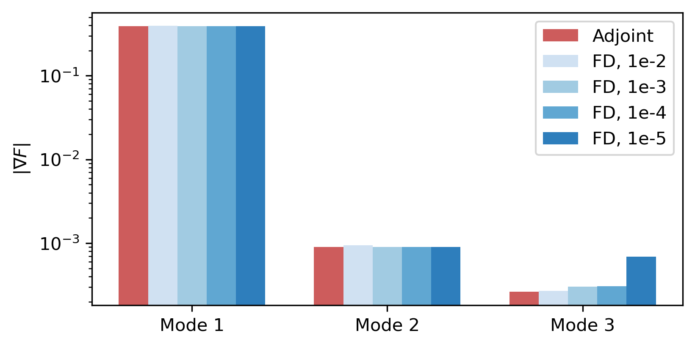
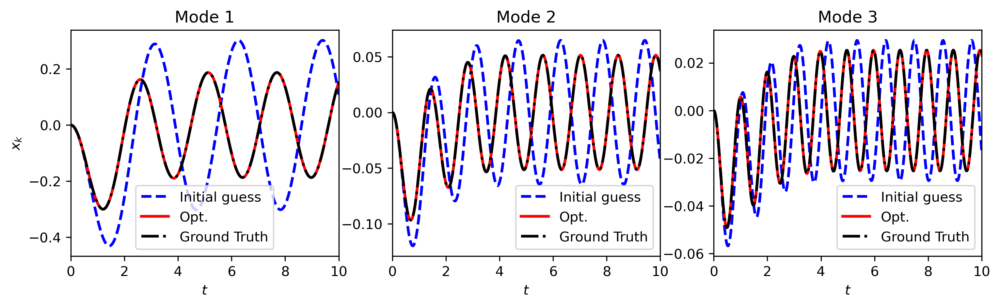
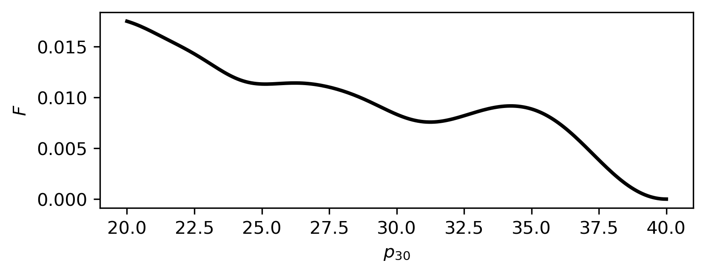
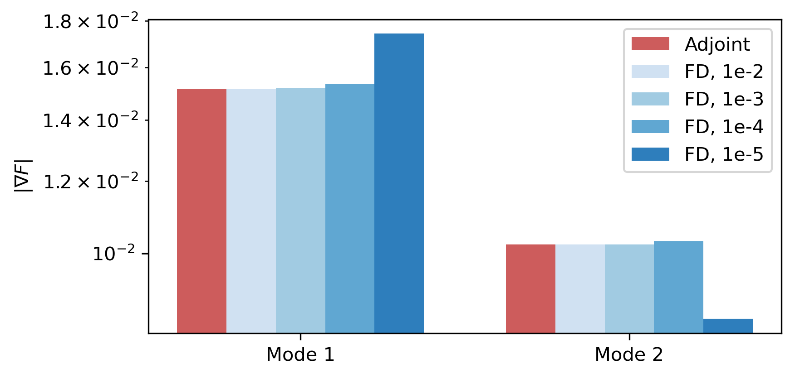
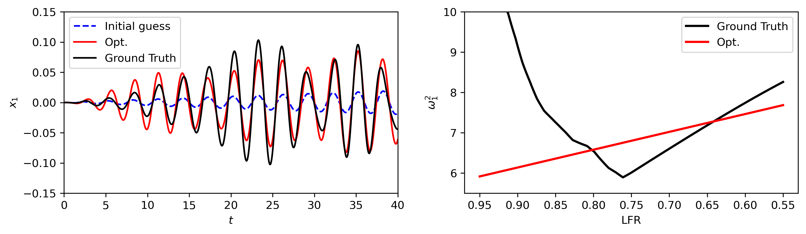
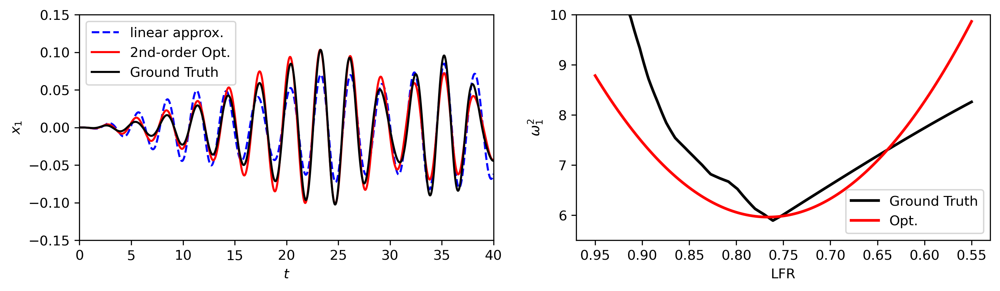
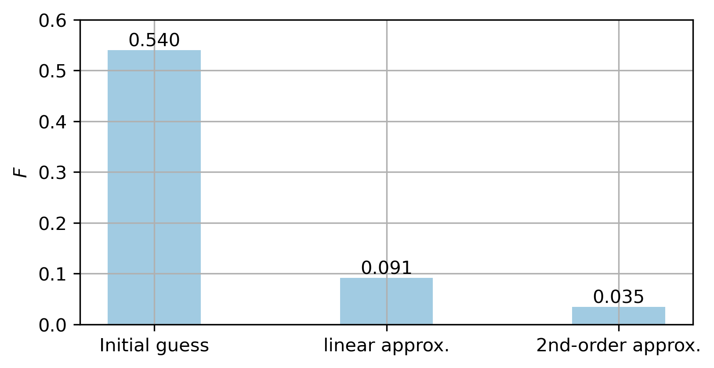

# **Slosh-PY**

Slosh-PY is totally based on the Slosh-ML repository (which is built by MATLAB). Slosh-PY is just a Python version of it. We develop this Python version mainly for later possible machine-learning demands.

Developed by Chenyu Wu, during the internship at Orienspace.

## **1.The mechanical parameters of sloshing**

According to the inviscid theory of ideal fluid, we can use spring-mass system or pendulum system to replace the sloshing fluid in the tank without affecting the mecahnical properties of the sloshing fluid. That is to say, under the same excitation, the mechanical analogy and the real sloshing fluid will generate identical response (in terms of the force and the torque produced).

In this repo, we use `Slosh-PY`, which is a Python version of `Slosh-ML`, to calculate the parameters of the mechanical analogy analytically. The key parameters including:

$$
\begin{aligned}
M_k(LFR),H_k(LFR),L_k(LFR)
\end{aligned}
$$

$M_k$ is the mass of the mass-spring system representing the $k^{th}$ sloshing mode, $H_k$ is the height of the mass-spring system measured from the mass-center of the fluid. $L_k$ it the length of the pendulum representing the $k^{th}$ sloshing mode. $LFR$ is the fill ratio of the tank ($LFR\in(0,1)$). The spring constant $K_k$ is then defined as:

$$
K_k(LFR, t)=M_k(LFR)\alpha_3/L_k(LFR)
$$

$\alpha_3$ is the equivalent gravity experienced by the sloshing fluid on the rocket. The equations above mean that both the mass and the location of the mechanical analogy are functions of the fill ratio and the equivalent gravity. On the other hand, the fill ratio and $\alpha_3$ change with time in the flight. Consequently, the mechanical parameters varies continously in the flight.

Assume that the only excitation is the lateral accerleration $\alpha_3(t)$, and the change in mechanical parameters in time does not cause any latency effect, then the equations of motion can be expressed as:

$$
\frac{d}{dt} \begin{pmatrix}
x_k\\v_k
\end{pmatrix}=\begin{pmatrix}
v_k\\
-\alpha_2-\omega_k^2x_k
\end{pmatrix},k=1,2,\cdots,

\omega_k^2=K_k/M_k, x_k(0),v_k(0)=0
$$

which is simply a second order ODE with time varying natural frequency.

## **2.Resolve the mechanical parameters from data**

Suppose that we've obtained the sloshing data from experiment or some other high-fidelity simulation (such as CFD). In this sloshing dataset, the response of each mode, the variation of $LFR$, $\alpha_3$, and the excitation (such as $\alpha_2$) with respect to time are also provided:

$$
q_k(t), LFR(t),\alpha_3(t),\alpha_2(t), t\in[0,T]
$$

$q_k(t)$ is the response of the mode $k$. Now we want to use the mechanical analogy in section 1 to build a model from this sloshing data. That is to say, we want to determine the relationship between $M_k, H_k,L_k$ and $LFR$ from this sloshing data. Note that the mechanical analogy described in section 1 that can exactly reconstruct the sloshing data may not exist because of the non-linear and viscous effect in experiment or the simulation. However, we are still interested in to what extent the linear mechanical analogy in section 1 can explain the sloshing data. 

I propose a method similar with the [FIML-Direct](https://www.researchgate.net/profile/Jonathan-Holland-5/publication/330198330_Towards_Integrated_Field_Inversion_and_Machine_Learning_With_Embedded_Neural_Networks_for_RANS_Modeling/links/5c3a42bfa6fdccd6b5a8852e/Towards-Integrated-Field-Inversion-and-Machine-Learning-With-Embedded-Neural-Networks-for-RANS-Modeling.pdf) used in the data-driven turbulence modeling paradigm, which is basically an approach to solve the inverse problem. I first express the square of natural frequency $\omega_k^2$ as a polynomial of $LFR$:

$$
\omega_k^2=\sum_{j=0}^{N_p} p_{kj} LFR^j
$$

Note that the exact expression of the square of natural frequency is:

$$
\omega_k^2=K_k/M_k=\alpha_3(t)/L_k(LFR)
$$

if we assume that $LFR(t)$ is an invertibale function (which is often the case since we cannot have two exactly the same $LFR$ at different times if the engine keeps running in the entire flight), then $\omega_k^2$ can indeed be expressed as a function of $LFR$. 

The coefficients $p_{kj}$ in the polynomial can be found by solving the following optimization problem:

$$
\min_{p_{kj}} F=\int_0^Tf(x,p,q)  dt=\int_0^T \sum_{k=1}^{N_{mode}}w_k[x_k(t)-q_k(t)]^2dt
$$

$x_k(t)$ is the response of the mechanical analogy under the excitation identical to the ones in the high-fidelity data when setting the polynomial coefficients to $p_{kj}$. $p$ is a vector containing the coefficients $p_{kj}$. 

I use continuous-adjoint method to compute the gradient of the objective function $F$. The adjoint equation of the equation of motion is:

$$
\frac{d}{dt}\begin{pmatrix}
\lambda_k\\ \eta_k
\end{pmatrix} = \begin{pmatrix}
\omega_k^2 \eta_k \\ -\lambda_k
\end{pmatrix}+2\begin{pmatrix}
x_k-q_k\\0
\end{pmatrix}, \lambda_k(T),\eta_k(T)=0
$$
The adjoint equation is solved backward in time. After obtaining the adjoint variable $\lambda_k(t)$, the gradient is computed as:

$$
h_k(t) = \begin{pmatrix}
x_{k}(t)\frac{\partial\omega^2_{k}}{\partial p_{k0}} & \cdots & x_{k}(t)\frac{\partial\omega^2_{k}}{\partial p_{kN_p}}
\end{pmatrix}
$$
$$
\nabla_p F=\int_0^T(\lambda_1(t),\cdots,\lambda_{N_{mode}}(t))\begin{pmatrix}
h_1(t) & O &\cdots & O\\
O & h_2(t) &\cdots & O\\
\cdots & \cdots &\cdots &\cdots\\
O & O &\cdots & h_{N_{mode}}(t)\\
\end{pmatrix}dt
$$

The optimization problem is then solved by `scipy.optimize.minimize` function.

### **2.1 Infer constant natural frequency**

We try to recover the constant natural fequency from the solution of a 2-nd vibration ODE ($\omega_k^2=p_{k0}$). The dataset we are using is:
$$
\frac{d}{dt} \begin{pmatrix}
q_k\\ \dot{q}_k
\end{pmatrix}=\begin{pmatrix}
\dot{q}_k\\
-\alpha_2-\omega_k^2q_k
\end{pmatrix},k=1,2,3
$$

$$
(\omega_1^2,\omega_2^2, \omega_3^2)=(6.0, 20.0, 40.0);q_k(0),\dot{q_k}(0)=0
$$

$$
\alpha_2(t)=\exp(-t^2/4)\\
\alpha_3(t)=g+5gt/150\\
LFR(t)=0.95 - (0.95-0.15)t/80
$$

$q_k(t)$ is the observed signal. We solve the ODE to $T=40$ to get the data. Now we try to use gradient optimization algorithm to recover the exact value of $\omega_k^2$ (that is, $p_{k0}$) from data. The gradient is computed by the continuous adjoint method. 

We check the accuracy of the gradient given by the continuous adjoint by comparing it with the result given by finite difference (FD). The adjoint (AD) sensitivity and the FD sensitivity are compared in the bar-plot below. The AD and the FD sensitivity agree well for large FD step. However, when the FD step gets smaller, the numrical error becomes more and more dominant, causing significant error in the sensitivity. Consequently, the AD is more reliable. On the other hand, the AD allows us to use the amount of time nearly identical to the amount of time spent on evaluating the objective to get the full gradient, while FD requires at least $N$ times of objective function evaluation, where $N$ is the number of parameters to be optimized. 

Solving the optimization problem using the `scipy.optimize.minimize` function, we get the following result shown in the figure. The signal produced by the optimized parameters overlaps with the groud truth signal (the $q_k$), demonstrating a great improvement compared with the initial guess. In fact, the exact natural frequency is fully recovered by the algorithm, as shown in the table.

| **$\omega_k^2$** | 6.0 | 20.0 | 40.0 |
|------------------|-----|------|------|
| **$p_{k0}$**     | 6.0 | 20.0 | 40.0 |

It should be noted that for the high frequency signal, like the signal of mode 2 and mode 3, the optimized parameter $p_{k0}$ is highly dependent on the initial guess. The variation of the objective with respective to the parameter $p_{30}$ is shown in the figure below. 2 local minimas can be found in the interval $(20,40)$. If the initial guess is around these 2 local minimas, the exact frequency will not be recovered by the gradient optimization algorithm. Consequently, in the future, I plan to use evolutionery algorithms to find a good-enough guess for the parameters first, and then switch to the gradient descent method to fully optimize the parameters.

### **2.2 Infer the natural frequency of the Saturn-V's tank**

In this section, we use Slosh-PY to get the true natural frequency-LFR relation of the Saturn-V's tank. After setting $\alpha_2(t),\alpha_3(t)$, and $LFR(t)$, we run a simulation to get the 'high-fidelity' sloshing data $q_k(t)$. Then the inverse problem is solved by performing gradient-based optimization. The $\alpha_2(t), \alpha_3(t)$, and the $LFR(t)$ are defined as:

$$
\begin{aligned}
\alpha_2(t)&=\sin(\frac{2\pi}{3}t)\tanh(\frac{t}{150})\\
\alpha_3(t)&=g+5gt/150\\
 LFR(t)    &=0.95 - (0.95-0.15)t/80
\end{aligned}
$$

According to the literature, only the first mode has a significant impact on the forces and torques produced by the liquid. Consequently, we set the weights in the objective function to:

$$
(w_1,w_2,w_3)=(10.0,0.0,0.0)
$$

We first try linear model to approximate the natural frequency $\omega_1^2$:

$$
\omega_1^2=p_{10}+p_{11}LFR
$$

The gradient of the objective function $F$ with respect to $p_{10}$ and $p_{11}$ is shwon in the figrue below. In this case, the numerical error in the FD result is more dominant, the error increases faster than the constant frequency case as the step becomes smaller and smaller, even for the $p_{10}$. This again emphasizes the importance of using adjoint method to compute the gradient.

The reconstructed signal and the inferred mechanical parameters are shown in the figure below. The linear model can approximate the $\omega_1^2-LFR$ relation when $LFR$ is low (when $t$ is large), thus producing a good agreement in the sloshing signal when $t$ is large. However, the $\omega_1^2-LFR$ relation deviates from the ground truth a lot when $LFR$ is large, giving a slightly larger error when $t$ is small.

We now further improve the estimation of the mechanical parameters by expanding the polynomial to second-order term:

$$
\omega_1^2(LFR)=p_{10}+p_{11}LFR+p_{12}LFR^2
$$

The initial guess is taken to be the result of the linear approximation with $p_{12}=0.0$. After optimization, the recovered signal and the inferred mechanical parameters are shown in the figure below. The accuracy at high $LFR$ is greatly improved by incorporating the 2nd-order term. On the other hand, the estimation of maximum sloshing maginitude also gets more accurate.

Now we compare the accuracy of the initial guess, the linear approximation, and the second-order approximation. As we increase the complexity of the model further, the error of the recovered signal drops progressively.

